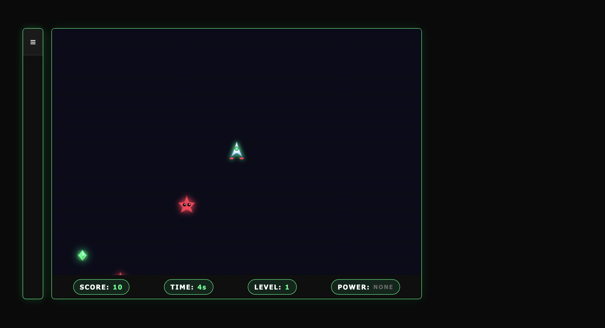
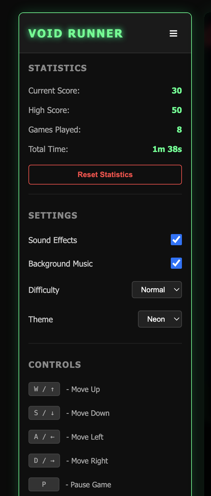

# VOID RUNNER

it is a browser-based survival game built to practice game development, Rust backend development, websockets, real-time state management, and client-server architecture.

## Decription
This is a simple survival game where the player controls a character, collects energy, & avoid enemy that continus chase the player  this game build on html, css, javascript, rust, axum and websocket. i built the frontend using html css & javascript. and game login and server side state are handle by rust.
it is a browser-based survival game built to practice game development you have to douch the enemy and collect the food, and you will get different power such as 2x speed, 2x score, shifty shield for protection, it has light, dark and neon theme which works perfect, has a menu option in sidebar for controlling all feature of the game. that increase your points, Rust backend development, websockets, real-time state management, and client-server architecture.

the rust backend is responsible for:
- player movement
- enemy spawing 
- enemy movement
- enemy movement 
- collision detection
- energy collection
- score calculation
- difficulty scaling 
- game state
- websocket communication
- player sessions
- the lamp battery, its radius and its recharge

## the lamp

the arena is dark and the lamp is the only way to see. this is a real mechanic rather than a colour swap: the battery lives in the server state, the light decides what you can see, and it changes how the game plays.

- the lamp starts switched on and fully charged
- press `f` to switch it off and on again
- it drains 5% a second while it burns, and recharges 5% a second while it is off
- a full charge throws light 270 units out, an empty one only 90, so the pool of light shrinks as the battery dies
- energy outside the light cannot be picked up at all, and it is worth 25 instead of 10 when you do reach it
- enemies move 1.6x faster while they are inside the light, so the lamp pulls them in on you
- a lantern power-up refills the battery and switches the lamp back on
- the dark and neon themes paint the arena black and cut the light and the beam back out of it, so anything out of reach is invisible. the light theme keeps its bright background and dims whatever the lamp does not reach instead

## screenshort 
### Demo 1


### Demo 2


the frontend is mainly responsiable for rendering the game and sending player input to the rust. the current architectuere uses a `GameServer` containing multiple player sessions:

```text
Game server -> playerId 1= game session
                playerid 2 = game session
                playerid 3= game session

## dependency
cargo add axum --features ws
cargo add tokio --features full
cargo add serde --features derive
cargo add serde_json
cargo add rand
cargo add futures-util

## Get started:
git clone https://github.com/rajayadavikrahi/space-game
cd space-game
cd client && python3 -m http.server 5500
cd .. && cd rust && cargo run


## License
This project is currently a game project. No specific open-source license has been added yet.
